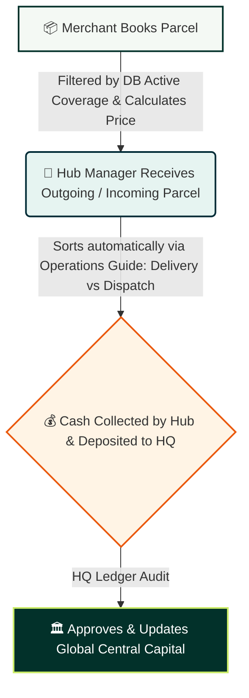

# 📦 TradeCen Courier | Enterprise Logistics & Terminal Ledger System

TradeCen Courier is a high-performance, hyper-local, and inter-district courier logistics ecosystem. It is architected to seamlessly automate regional hub sorting procedures, orchestrate the central treasury pipelines (HQ Central Ledger), and streamline dynamic merchant payout lifecycles. 

Featuring a premium corporate dark-teal aesthetic, the platform implements robust state management, reactive conditional layouts, and data-driven computational pricing engines.

---

## 🛠️ Core Technology Stack

| Layer | Technology | Purpose |
| :--- | :--- | :--- |
| **Frontend** | React.js, Tailwind CSS | Reactive SPA UI with tailored utility-first responsive styling. |
| **Backend** | Node.js, Express.js | Event-driven RESTful API routing architecture. |
| **Database** | MongoDB | Document-based schema layout optimized for rapid geographical lookups. |
| **Feedback UI** | SweetAlert2 | Custom-branded state alerts and cryptographic operational flags. |

---

## 🚀 Key Operational Flows & Business Logic

### 1. Dynamic Pricing & Coverage Engine
Geographical boundaries and pricing algorithms have been migrated from hardcoded assets into dynamic MongoDB collections to allow real-time runtime configuration.

* **Dependent Dropdown Pipeline:** When a merchant initiates a parcel entry, the application executes optimized queries to dynamically populate destination inputs following a relational hierarchy: `Region` ➔ `District` ➔ `Local Sub-Hub (Covered Area)`.
* **Administrative Status Invalidation (Live Switch):** Toggling an area's status to `inactive` inside the Admin Panel instantly strips it from the merchant booking views via real-time filtering logic.
* **Pricing Algorithm:** Real-time logistics cost calculation utilizes ceiling rounding functions to calculate cumulative bulk weights:

$$\text{Total Cost} = \text{Base Cost} + (\lceil\text{Weight} - 1\rceil \times \text{Extra Fee}) + \text{COD Fee}$$

### 2. HQ Central Finance Ledger (Liquidity Pipeline)
To maintain cryptographic integrity over branch cash flows, a rigid security pipeline manages physical cash transitions between remote terminals and the head office.

* **Hub Audit Submissions:** Local managers bundle operational metrics (Total Parcel Volume, Physical Cash Receipts, and Transaction Slip References) into an immutable ledger request.
* **Headquarters Reconciliation:** Requests are processed through a zero-border, hyper-scannable data grid. Upon manually validating bank receipts, the HQ Administrator executes a `Verify & Accept` transaction, moving funds into the company's central liquid capital balance.

### 3. Automated Hub Sorting & Routing Logic
Terminal dashboards filter high-volume queues automatically into tactical delivery pipelines through a strict localized route matching system:

> 📌 **Local Delivery Allocation:** Matches incoming shipments where the terminal node destination explicitly equals the current session hub (`receiverCity === managerData.hubName`). These are instantly prioritized for local last-mile courier assignment.
>
> 🚀 **Hub Dispatch Allocation:** Captures newly picked-up outgoing parcels destined for external districts. The system aggregates these items into heavy freight manifests routed directly to regional transit gateways.

### 4. Global System Control Room (`/system-settings`)
A centralized management console empowers administrators to update platform behavior on-the-fly without codebase redeployments.
* **Logistics Parameters:** Live configuration inputs modify database parameters globally for parameters like `Inside City Base Rate`, `Outside City Base Rate`, and `COD Commission %`.
* **System Operations Toggle:** Features an emergency master switch to toggle **Maintenance Mode** (locking downstream entry components during high-traffic updates) or suspend open registration endpoints.

---

## 🗄️ Database Schema Blueprint

### 1. `coverages` Collection
```json
{
  "_id": "geo_dhaka_01",
  "region": "Dhaka",
  "district": "Dhaka",
  "city": "Dhaka",
  "covered_area": ["Uttara", "Dhanmondi", "Mirpur", "Mohammadpur"],
  "status": "active",
  "longitude": 90.4125,
  "latitude": 23.8103
}
```
```
### 1. `pricing` Collection
{
  "_id": "global_pricing_rules",
  "insideCity": { "baseCost": 60, "extraWeightFee": 20 },
  "outsideCity": { "baseCost": 120, "extraWeightFee": 30 },
  "codFeePercentage": 1
}
```
---

## 🏃‍♂️ Operational Architecture Summary


